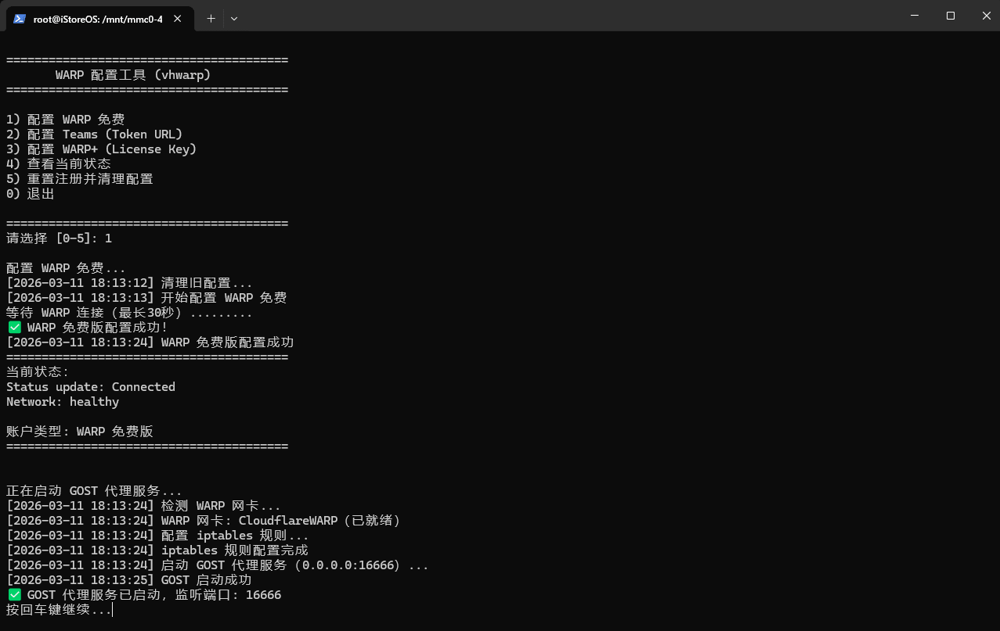

# vh-warp

🥝 轻量级 Docker 镜像封装 Cloudflare WARP，快速搭建局域网可访问的代理服务，极简部署、极致性能、极其稳定。

## 特性
- 🚀 一键部署：Docker 化封装，无需复杂配置，快速启动 WARP 代理
- 🌐 局域网共享：代理服务暴露至局域网，多设备共用 WARP 网络
- 📝 日志整洁：WARP 日志隔离存储，Docker 日志无冗余输出
- 📦 日志可控：自动轮转+大小限制，避免日志文件占用过多空间
- 💻 多架构适配：支持 amd64/arm64（服务器/软路由/树莓派均适用）
- 🔑 账号管理：支持 WARP 免费版、WARP+、Teams (Zero Trust) 账号配置
- 🎯 交互配置：内置 vhwarp 配置工具，菜单式操作，简单易用

## 快速开始

### 构建镜像

```sh
git clone https://github.com/uxiaohan/vh-warp.git
cd vh-warp
docker buildx build --no-cache -t vh-warp:latest .
```

### 启动容器

**Docker Compose**

```sh
version: '3.8'

services:
  vh-warp:
    image: uxiaohan/vh-warp:latest
    container_name: vh-warp
    cap_add:
      - NET_ADMIN
      - NET_RAW
      - MKNOD
    device_cgroup_rules:
      - 'c 10:200 rwm'
    ports:
      - "16666:16666"
    sysctls:
      - net.core.somaxconn=65535
      - net.ipv4.conf.all.src_valid_mark=1
      - net.ipv4.ip_forward=1
    restart: unless-stopped
```

**Docker 命令**

```sh
docker run -d \
  --name vh-warp \
  --cap-add=NET_ADMIN \
  --cap-add=NET_RAW \
  --cap-add=MKNOD \
  --device-cgroup-rule 'c 10:200 rwm' \
  -p 16666:16666 \
  --sysctl net.core.somaxconn=65535 \
  --sysctl net.ipv4.conf.all.src_valid_mark=1 \
  --sysctl net.ipv4.ip_forward=1 \
  uxiaohan/vh-warp:latest
```

### 配置 WARP

```sh
# 进入容器
docker exec -it vh-warp bash

# 运行配置工具
vhwarp
```



选择配置方式：
1. WARP 免费版
2. Teams (Zero Trust)
3. WARP+ (License Key)


### 使用代理

局域网内设备配置代理地址（支持 HTTP/SOCKS5 混合代理）

```
http://容器IP:16666
socks5://容器IP:16666
```

## 日志文件

所有日志保存在 `/var/log/warp-gost/`：

- `warp-svc.log` - WARP 服务日志
- `gost.log` - GOST 代理日志
- `vhwarp.log` - 配置工具日志
- `entrypoint.log` - 启动日志

查看日志：
```sh
docker exec -it vh-warp tail -f /var/log/warp-gost/warp-svc.log
```

### WARP 连接失败

```sh
# 进入容器
docker exec -it vh-warp bash

# 查看状态
warp-cli --accept-tos status

# 重置配置
vhwarp
# 选择 "5) 重置注册并清理配置"
```

### 感谢您的打赏💗


