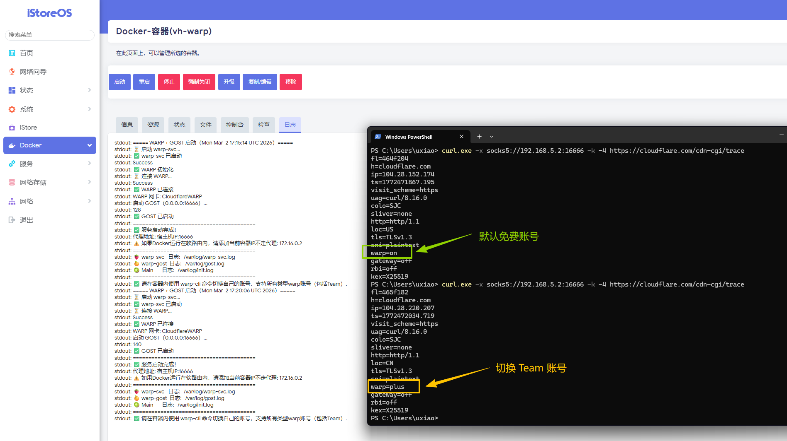

# 🥝 vh-warp

> Lightweight Docker image powered by Cloudflare WARP. One-click deploy privacy protection + network acceleration. Supports Free / Plus / Teams accounts.

[](https://hub.docker.com/r/uxiaohan/vh-warp) [中文文档](#中文文档)

## ✨ Features

- 🚀 **One-click Deploy** — Docker Compose single command startup, auto-registers free tier on first run, truly zero-config
- 🔒 **Privacy Protection** — All proxy traffic exits through Cloudflare WARP, hiding the host IP
- ⚡ **Network Acceleration** — WARP global edge network, lower latency, better connection experience
- 🔄 **Dual-Protocol Proxy** — Mixed SOCKS5 + HTTP on single port 1111, auto-detects protocol
- 👤 **Multi-Account** — WARP Free / WARP+ (License Key) / Teams (Zero Trust)
- 💓 **Self-Healing** — Built-in heartbeat monitoring, 4-level progressive auto-recovery, GOST process auto-restart
- 🔔 **Instant Notifications** — Optional PushDeer push for disconnection, recovery, and emergency events
- 🎮 **Interactive Menu** — `vhwarp` config tool, full menu-driven, beginner-friendly
- 🖥️ **Multi-Arch** — amd64 / arm64, works on servers, routers, and Raspberry Pi
- 📏 **Log Control** — Auto-rotated, keeps latest 3MB, ideal for low-memory environments
- 🩺 **Docker Health Check** — Built-in HEALTHCHECK reports proxy status; recovery is handled by the in-container watchdog
- 🚅 **GOST Optimized** — Nagle disabled, 64KB read/write buffers, TCP keepalive, tuned for router scenarios
## 🚀 Quick Start

### 🐳 Pull from Docker Hub (Recommended)

```bash
# Download docker-compose.yml
wget https://raw.githubusercontent.com/uxiaohan/vh-warp/main/docker-compose.yml
# Start
docker compose up -d
```

### 🔨 Build Locally

```bash
git clone https://github.com/uxiaohan/vh-warp.git
cd vh-warp
docker compose -f docker-compose.build.yml build
docker compose -f docker-compose.build.yml up -d
```

## ⚙️ Configuration

The container auto-registers WARP Free tier on first startup. To switch to WARP+ or Teams, use `vhwarp`:

```bash
docker exec -it vh-warp vhwarp
```

```
  ██╗   ██╗██╗  ██╗       ██╗    ██╗ █████╗ ██████╗ ██████╗
  ██║   ██║██║  ██║       ██║    ██║██╔══██╗██╔══██╗██╔══██╗
  ██║   ██║███████║       ██║ █╗ ██║███████║██████╔╝██████╔╝
  ╚██╗ ██╔╝██╔══██║       ██║███╗██║██╔══██║██╔══██╗██╔═══╝
   ╚████╔╝ ██║  ██║       ╚███╔███╔╝██║  ██║██║  ██║██║
    ╚═══╝  ╚═╝  ╚═╝        ╚══╝╚══╝ ╚═╝  ╚═╝╚═╝  ╚═╝╚═╝
  ─────────────────────────────────────────────────────────
    ☁️  Cloudflare WARP Privacy · Network Acceleration
  ─────────────────────────────────────────────────────────

  +==============================================+
  |           vh-warp Config Tool               |
  +==============================================+
  |  1)  WARP Free          MASQUE, no account   |
  |  2)  Teams / Zero Trust  Enter Token URL     |
  |  3)  WARP+ (License Key) Enter License Key   |
  |  4)  View Status                             |
  |  5)  Reset & Clean                           |
  |  6)  PushDeer Notification                   |
  |  0)  Exit                                    |
  +==============================================+

  Select [0-6]:
```

Before enrolling a Teams / Zero Trust account, configure its WARP device profile in the Zero Trust dashboard:

- **Mode switch**: Enabled
- **Tunnel protocol**: MASQUE
- **Service mode**: Local proxy mode

GOST exposes port `1111` and forwards all client proxy traffic through Cloudflare WARP.



## 🌐 Proxy Usage

Configure proxy on your LAN devices:

```
SOCKS5:  192.168.x.x:1111
HTTP:    192.168.x.x:1111
```

> Port 1111 uses Mixed mode and supports both HTTP and SOCKS5, with all traffic forwarded to the WARP local proxy.

## 💓 Health Check & Auto-Recovery

The container runs a built-in self-healing daemon that continuously monitors `warp=on` and automates recovery for the entire chain:

| 🔁 Consecutive Failures | 🛠️ Action | 📢 PushDeer Notification |
|:---:|------|------|
| 1 | 📝 Log, check GOST process | 🟡 "WARP check failed..." |
| 2 | 🔧 Auto-restart GOST | — |
| 3 | 🔄 Soft reconnect `disconnect → connect` | 🔧 "WARP soft reconnect" |
| Unavailable for 10 min | 💥 Verify direct Internet, retry current registration, then fall back to Free | ✅ "WARP recovered as Free" |

When proxy checks fail, the watchdog first verifies GOST and tries two independent WARP trace endpoints. It preserves the current registration during transient failures and soft reconnects. Before falling back, it disconnects WARP and verifies that the host's direct Internet works, then makes one final attempt with the original registration.

If WARP remains unavailable for 10 minutes while direct Internet is healthy, the watchdog falls back to Free to restore service. WARP+/Teams credentials are not stored and are not automatically restored. If Free registration is temporarily unavailable, registration retries use backoff and the exposed proxy remains unavailable until WARP recovers. GOST never bypasses WARP to use the host egress directly. Set `HEALTH_FALLBACK_AFTER` to adjust the fallback delay.

Cloudflare One Client 2026.6 and later requires outbound HTTPS access to `api.devices.cloudflare.com` for registration and settings.

## 🔔 PushDeer Notifications

Enter the config menu **6) PushDeer Notification** to set your PushKey:

1. 📲 Install the [PushDeer App](https://www.pushdeer.com/)
2. 🔑 Get your PushKey from the App
3. 📝 Enter the PushKey in vhwarp — a test notification confirms the setup

Once configured, all disconnect, reconnect, emergency, and recovery events are pushed to your phone in real time 📱

## 📋 Logs

Logs are stored in `/var/log/warp-gost/`, capped at 3MB per file with auto-rotation:

| 📄 File | 📝 Content |
|------|------|
| `warp-svc.log` | Cloudflare WARP service log |
| `gost.log` | GOST proxy service log |
| `health-check.log` | 💓 Health check log |
| `vhwarp.log` | ⚙️ Config tool operation log |
| `entrypoint.log` | 🚀 Container startup log |
```bash
# View health check logs in real time
docker exec -it vh-warp tail -f /var/log/warp-gost/health-check.log
```

## 📦 Docker Run

```bash
docker run -d \
  --name vh-warp \
  --restart=always \
  -p 1111:1111 \
  -v warp-data:/var/lib/cloudflare-warp \
  uxiaohan/vh-warp:latest
```

> Default timezone is `Asia/Shanghai`. Override with `-e TZ=Europe/London`. Proxy-side DNS requests follow the GOST upstream through WARP; no extra system DNS configuration is needed.

## 🩺 Troubleshooting

```bash
# Check WARP connection status
docker exec -it vh-warp warp-cli status

# View health check history
docker exec -it vh-warp cat /var/log/warp-gost/health-check.log

# View Docker health status
docker inspect --format='{{.State.Health.Status}}' vh-warp

# Collect official Cloudflare diagnostics
docker exec -it vh-warp warp-diag

# Reset everything and start over
docker exec -it vh-warp vhwarp
# → Select "5) Reset & Clean"
```

---

## 中文文档

## ✨ 特性

- 🚀 **一键部署** — Docker Compose 一行命令启动，首次自动注册免费版，真正零配置
- 🔒 **隐私保护** — Cloudflare WARP 加密隧道，隐藏真实 IP，防止追踪
- ⚡ **网络加速** — WARP 全球边缘网络，降低延迟，提升连接体验
- 🔄 **双协议代理** — Mixed SOCKS5 + HTTP，单端口 1111 自动识别协议
- 👤 **多账号支持** — WARP Free / WARP+ (License Key) / Teams (Zero Trust)
- 💓 **断线自愈** — 内置心跳检测，四级渐进式自动恢复链路，GOST 进程自动重启
- 🔔 **即时通知** — 可选 PushDeer 推送，断线、恢复、急救实时报信
- 🎮 **交互菜单** — `vhwarp` 配置工具，全菜单操作，新手友好
- 🖥️ **多架构适配** — amd64 / arm64，服务器、软路由、树莓派均可运行
- 📏 **日志可控** — 自动轮转保留最新 3MB，适合低内存环境
- 🩺 **Docker 健康检查** — 内置 HEALTHCHECK 上报代理状态，容器内守护进程负责恢复
- 🚅 **GOST 优化** — Nagle 禁用、读写缓冲区 64KB、TCP keepalive，适配软路由场景

## 🚀 快速开始

### 🐳 直接拉取（推荐）

```bash
# 下载 docker-compose.yml
wget https://raw.githubusercontent.com/uxiaohan/vh-warp/main/docker-compose.yml
# 启动
docker compose up -d
```

### 🔨 本地构建

```bash
git clone https://github.com/uxiaohan/vh-warp.git
cd vh-warp
docker compose -f docker-compose.build.yml build
docker compose -f docker-compose.build.yml up -d
```

## ⚙️ 配置

容器首次启动时自动注册 WARP 免费版，开箱即用。如需切换 WARP+ 或 Teams，使用 `vhwarp`：

```bash
docker exec -it vh-warp vhwarp
```

```
  ██╗   ██╗██╗  ██╗       ██╗    ██╗ █████╗ ██████╗ ██████╗
  ██║   ██║██║  ██║       ██║    ██║██╔══██╗██╔══██╗██╔══██╗
  ██║   ██║███████║       ██║ █╗ ██║███████║██████╔╝██████╔╝
  ╚██╗ ██╔╝██╔══██║       ██║███╗██║██╔══██║██╔══██╗██╔═══╝
   ╚████╔╝ ██║  ██║       ╚███╔███╔╝██║  ██║██║  ██║██║
    ╚═══╝  ╚═╝  ╚═╝        ╚══╝╚══╝ ╚═╝  ╚═╝╚═╝  ╚═╝╚═╝
  ─────────────────────────────────────────────────────────
    ☁️  Cloudflare WARP 隐私保护 · 网络加速
  ─────────────────────────────────────────────────────────

  +==============================================+
  |              vh-warp 配置工具                |
  +==============================================+
  |  1)  WARP 免费版       MASQUE 协议，无需账号  |
  |  2)  Teams / Zero Trust  输入 Token URL       |
  |  3)  WARP+ (License Key)  输入 License Key    |
  |  4)  查看当前状态                             |
  |  5)  重置并清理配置                           |
  |  6)  PushDeer 断线通知                        |
  |  0)  退出                                    |
  +==============================================+

  请选择 [0-6]:
```

使用 Teams / Zero Trust 账号注册前，请先在 Zero Trust 后台配置对应的 WARP 设备配置文件：

- **模式切换**：开启
- **隧道协议**：MASQUE
- **服务模式**：本地代理模式

GOST 对外暴露 `1111` 端口，并将所有客户端代理流量通过 Cloudflare WARP 转发。


## 🌐 使用代理

局域网设备配置代理地址即可：

```
SOCKS5:  192.168.x.x:1111
HTTP:    192.168.x.x:1111
```

> 端口 1111 为 Mixed 模式，同一端口同时支持 HTTP 和 SOCKS5，所有流量均转发至 WARP 本地代理。

## 💓 心跳检测与自愈

容器内置断线自愈守护进程，后台持续检测 `warp=on`，自动化恢复整条链路：

| 🔁 连续失败 | 🛠️ 动作 | 📢 PushDeer 通知 |
|:---:|------|------|
| 1 | 📝 记录日志，检测 GOST 进程存活 | 🟡 "WARP 检测异常..." |
| GOST 异常 | 🔧 自动重启 GOST | — |
| 3 | 🔄 软重连 `disconnect → connect` | 🔧 "WARP 软重连" |
| 持续不可用 10 分钟 | 💥 验证直连、最后重试原注册，再回退 Free | ✅ "WARP 已恢复为 Free" |

代理检测失败时先检查 GOST，并使用两个独立 WARP trace 端点复核。短暂异常只执行保留注册的软重连。回退前会断开 WARP 验证宿主直连网络，再使用原注册做最后一次连接尝试；宿主网络本身异常时不会删除注册。

当 WARP 持续不可用 10 分钟、宿主直连正常且原注册最后重连仍失败时，系统才回退到 Free。WARP+/Teams 凭据不会保存，也不会自动恢复。Free 注册 API 暂时不可用时，系统使用退避策略重试，WARP 恢复前对外代理保持不可用。GOST 不会绕过 WARP 使用服务器直连出口。可通过 `HEALTH_FALLBACK_AFTER` 调整回退时间。

Cloudflare One Client 2026.6 及更高版本注册和同步设置需要放行 `api.devices.cloudflare.com` 的出站 HTTPS。

## 🔔 PushDeer 通知

进入配置菜单 **6) PushDeer 断线通知** 设置 PushKey：

1. 📲 安装 [PushDeer App](https://www.pushdeer.com/)
2. 🔑 在 App 中获取 PushKey
3. 📝 在 vhwarp 中输入 PushKey，自动发送测试通知确认

配置后，所有断线、重连、急救、恢复事件均实时推送到你手机 📱

## 📋 日志

日志保存在 `/var/log/warp-gost/`，单文件上限 3MB 自动截断：

| 📄 文件 | 📝 内容 |
|------|------|
| `warp-svc.log` | Cloudflare WARP 服务日志 |
| `gost.log` | GOST 代理服务日志 |
| `health-check.log` | 💓 心跳检测日志 |
| `vhwarp.log` | ⚙️ 配置工具操作日志 |
| `entrypoint.log` | 🚀 容器启动日志 |

```bash
# 实时查看健康检测日志
docker exec -it vh-warp tail -f /var/log/warp-gost/health-check.log
```

## 📦 Docker Run

```bash
docker run -d \
  --name vh-warp \
  --restart=always \
  -p 1111:1111 \
  -v warp-data:/var/lib/cloudflare-warp \
  uxiaohan/vh-warp:latest
```

> 镜像默认时区 `Asia/Shanghai`，可通过 `-e TZ=Europe/London` 覆盖。客户端 DNS 请求通过 GOST 转发到 WARP 本地代理，无需额外配置系统 DNS。

## 🩺 故障排查

```bash
# 查看 WARP 连接状态
docker exec -it vh-warp warp-cli status

# 查看心跳检测历史
docker exec -it vh-warp cat /var/log/warp-gost/health-check.log

# 查看 Docker 健康状态
docker inspect --format='{{.State.Health.Status}}' vh-warp

# 收集 Cloudflare 官方诊断包
docker exec -it vh-warp warp-diag

# 重置所有配置并重新来过
docker exec -it vh-warp vhwarp
# → 选择 "5) 重置并清理配置"
```

---

## ☕ 捐赠支持

如果这个项目对你有帮助，欢迎请我喝杯咖啡～


> 感谢每一位 Sponsor，你的支持是我持续维护的动力 💪

---

## ⚠️ 免责声明

本项目仅供学习与技术研究使用。使用者应遵守所在国家/地区的法律法规，不得将此工具用于任何非法用途。项目作者不承担任何因使用本工具而产生的法律责任。

Cloudflare, the Cloudflare logo, and Cloudflare WARP are trademarks of Cloudflare, Inc. This project is not affiliated with, endorsed by, or sponsored by Cloudflare, Inc.

## 📜 License

MIT
